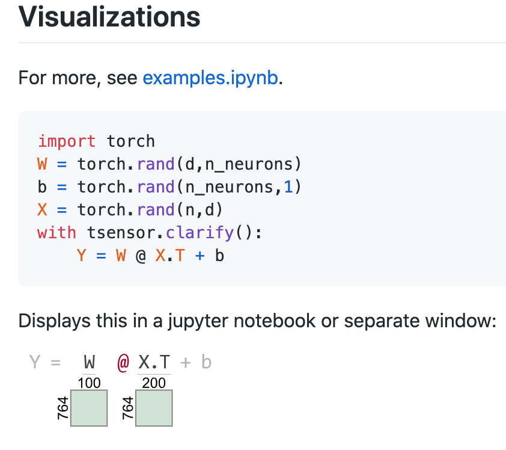

# Visualization

## Tensor shape visualization during manipulation
[Tensor Sensor](https://github.com/parrt/tensor-sensor/blob/master/testing/examples.ipynb) package
### Installation
```
pip install tensor-sensor
```
### Usage

